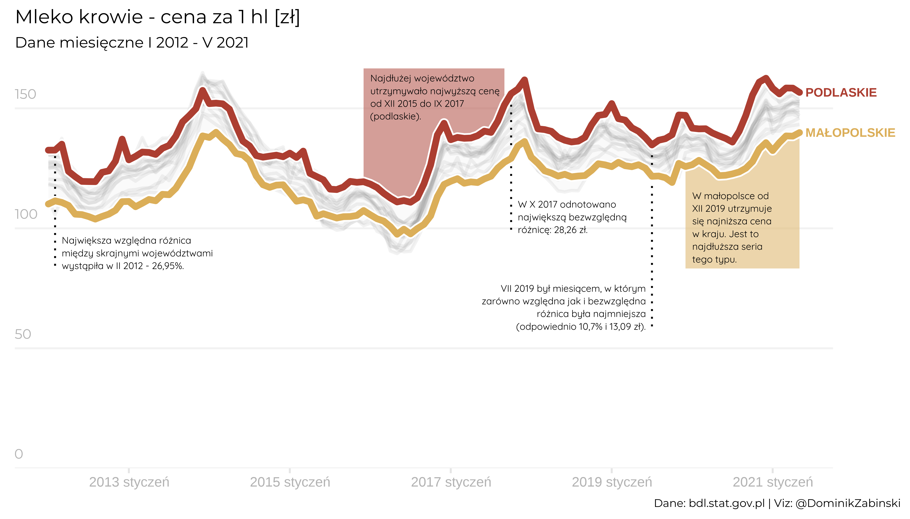

# social_media

This repository is dedicated to analysis and graphics shared on social media. The most frequently discussed topics are healthcare and human capital.

## Profilaktyka nowotworowa / Cancer screeninig rates
</img>

## Pełno oczekiwań wobec niepełnej bazy? / Full of expectations for a not quite full database?
</img>

## Średnia cena krowiego mleka / Average purchase prices of cow milk 
</img>

## Garbage (codes) in - garbage (actions) out
</img>

## Rate of COVD-19 positive tests
</img>
